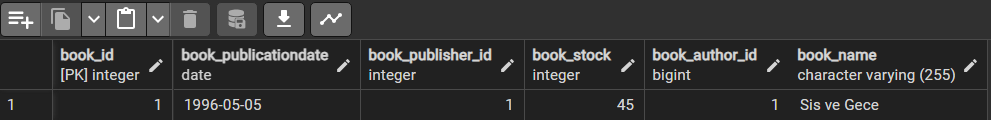
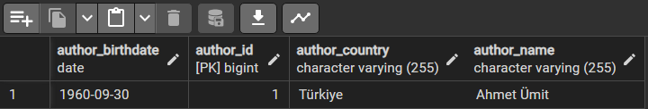
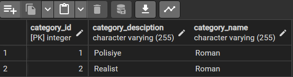
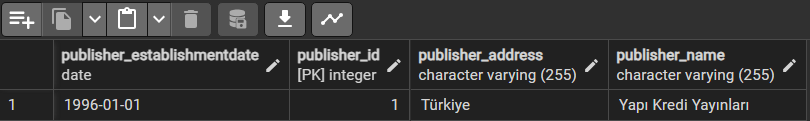
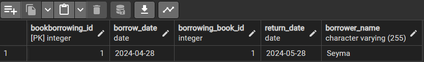
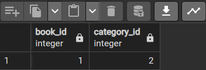

# Kütüphane Yönetim Sistemi Projesi

Bu proje, bir kütüphane yönetim sistemi için basit bir örnek uygulamadır. Bu uygulama, kitapların, yazarların, yayınevlerinin ve kategorilerin kaydedilmesini, görüntülenmesini ve yönetilmesini sağlar. Ayrıca, kitap ödünç alma ve iade işlemlerini takip eder.

## Proje Yapısı

Projede, aşağıdaki bileşenler bulunmaktadır:

- **Main.java**: Uygulamanın giriş noktası ve temel iş mantığının bulunduğu sınıf.
- **Author.java**: Yazar nesnesinin modelini temsil eden sınıf.
- **Book.java**: Kitap nesnesinin modelini temsil eden sınıf.
- **Publisher.java**: Yayınevi nesnesinin modelini temsil eden sınıf.
- **Category.java**: Kategori nesnesinin modelini temsil eden sınıf.
- **BookBorrowing.java**: Kitap ödünç alma işlemlerini temsil eden sınıf.
- **persistence.xml**: JPA yapılandırma dosyası.

## Kullanılan Teknolojiler

- Java 21
- Maven
- Hibernate (JPA implementation)
- PostgreSQL (database)

## Veritabanı Hakkında

- author: Yazar bilgilerini saklar.
- publisher: Yayıncı bilgilerini saklar.
- book: Kitap bilgilerini saklar.
- category: Kitap kategorilerini saklar.
- bookborrowing: Kitap ödünç alma işlemlerini saklar.

- Book Table

  

- Author Table

  

- Category Table

  

- Publisher Table

  

- BookBorrowing Table

  

- CategoryBook Table

  
